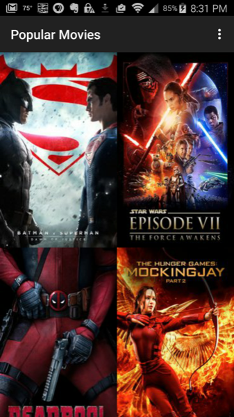
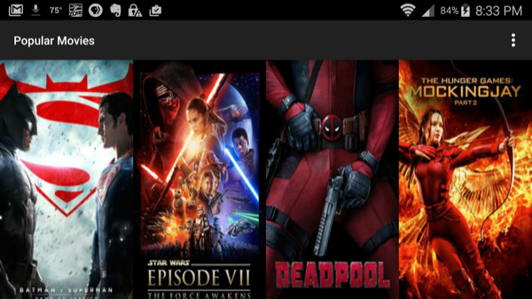
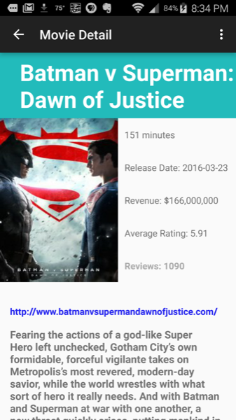
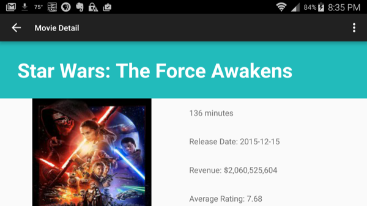

# PopularMovies1
This Android Developer Nanodegree project uses the themovieDB API to display movie information about popular and critically acclaimed movies. 
##Objectives
- Movies are displayed in the main layout via a grid of their corresponding movie poster thumbnails.
- UI contains an element (i.e a spinner or settings menu) to toggle the sort order of the movies by: most popular and highest rated.
- UI contains a screen for displaying the details for a selected movie.

- Movie details layout contains title, release date, movie poster, vote average, and plot synopsis.

##Issues

This first version of Popular Movies is optimized only for phones.

##Libraries
- [Picasso](http://square.github.io/picasso) for loading images.
- [Volley](https://android.googlesource.com/platform/frameworks/volley)  for network requests.

##Installation 
Download the zip file and extract the contents.  From Android Studio, File - New  - Import Project. Then navigate to the top level of the PopularMovies1 project and click Ok.  An API Key needs to be downloaded from this link:[https://www.themoviedb.org/account/signup] (https://www.themoviedb.org/account/signup).
Add the Key to the following entry in the utilies/HttpHelper.java file in the project:

`private static final String key = "";`

##License

Licensed under the Apache License, Version 2.0 (the "License"); you may not use this file except in compliance with the License. You may obtain a copy of the License at

   http://www.apache.org/licenses/LICENSE-2.0
Unless required by applicable law or agreed to in writing, software distributed under the License is distributed on an "AS IS" BASIS, WITHOUT WARRANTIES OR CONDITIONS OF ANY KIND, either express or implied. See the License for the specific language governing permissions and limitations under the License.

All libraries used are licensed under their own licensing agreement.

##Images

